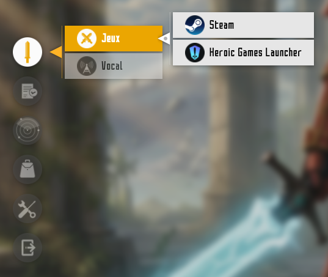

SAOLauncher
=====

This app is a fan-based desktop app launcher for Linux, based on Sword Art Online.

It shows an animated drop down menu to start your selected apps as Kirito uses his in-game menu in SAO.

When the or the shortcut is used, the launcher appears in the foreground for you to start the app you want, without having to look for it.
As soon as the chosen app starts, the launcher collapses and closes itself.

Compatibility
-----

This app has been written to work on Nobara (Fedora 42) distribution.

It is made for Gnome (49) Wayland, but could be used by any Linux system.

Installation
-----

1 - Download the files.

2 - Extract the files from the archive

3 - Run the file named "installer.sh" with a double click or right click it, then click "run as executable".
    If none of these options work, use these commands in the terminal :

    cd ~/Downloads/SAOLauncher-main/SAOLauncher-main/sao-launcher
    sudo sh ./installer.sh

4 - Let the installer start.
    Enter your admin password when asked and everything is installed.

Customization
-----

To customize the launcher, click the "+" button in the launcher itself.
- Each icon can be changed from the "Icons" button".
- You can edit the structure of the launcher as you want from "Config File" button :

1 - Architecture of the menu

        {
          "menu_items": {
            "Gaming": {
              "Games": {
                "Steam": null,
                "Heroic Games Launcher": null
              },
              "Vocal": {...}
            },

            "Desktop": {...},

            "Web": {...},

            "Explorer": {...},

            "Settings": {...},
    
            "Edit SAO Launcher": null,

            "Close": null
          },

In the first menu will appear : Gaming, Desktop, Web, Explorer, Settings, Edit SAO Launcher and Close.

If you click Gaming, a sub-menu will open with : Games and Vocal.

If you click Games, an other sub-menu will open with : Steam and Heroic Games Launcher

You can add as many buttons as you like, following the pattern above.

2 - Definition of the button functions

    "commands": {
      "Steam": ["steam"],
      "Heroic Games Launcher": ["flatpak", "run", "com.heroicgameslauncher.hgl"],
      "Discord": ["flatpak", "run", "com.discordapp.Discord"],
      "Thunderbird": ["flatpak", "run", "org.mozilla.Thunderbird"],
      "Only Office": ["flatpak", "run", "org.onlyoffice.desktopeditors"],
      "Chrome": ["flatpak", "run", "com.google.Chrome"],
      "Document Scanner": ["simple-scan"],
      "Krita": ["flatpak", "run", "org.kde.krita"],
      "Inkscape": ["inkscape"],
      "Geany": ["flatpak", "run", "org.geany.Geany"],
      "FileZilla": ["flatpak", "run", "org.filezillaproject.Filezilla"],
      "Files": ["nautilus"],
      "Input Remapper": ["sudo", "/usr/bin/input-remapper-gtk"],
      "Software": ["gnome-software"],
      "Extension Manager": ["flatpak", "run", "com.mattjakeman.ExtensionManager"],
      "System Update": ["sudo", "/usr/bin/nobara-updater"],
      "Nobara Driver Manager": ["nobara-driver-manager"],
      "Terminal": ["ptyxis"],
      "Disks": ["gnome-disks"],
      "Disk Usage Analyzer": ["baobab"],
      "System Monitor": ["gnome-system-monitor"],
      "Adjustments": ["gnome-tweaks"],
      "Parameters": ["gnome-control-center"]
    },

Depending of the way the app you want to start has been installed (package manager, Gnome store, flatpak), you have to add a block with one of these structures.
The label has to be exactly the same as in the architecture.

3 - Icon setting

        self.ICON_MAP = {
            "Gaming": "One-Handed Straight Sword.svg",
            
            "Games": "Dual Blades.svg",
            [...]
        }
        self.ICON_ACTIVE_MAP = {
            "Gaming": "One-Handed Straight Sword_on.svg",
            
            "Games": "Dual Blades_on.svg",
            [...]
        }

Each button has 2 icons to be set :
- one base icon in self.ICON_MAP
- one active icon in self.ICON_ACTIVE_MAP (visible when the mouse passes over the button or when you click it)
The label has to be exactly the same as in the architecture.

Launch
-----

1 - Open your keyboard options and create a new shortcut for you to open the launcher.

2 - Set the shortcut to issue the following command :

    python3 /opt/saolauncher/saolauncher.py

3 - Once the shortcut is set, you can use it to open the launcher at any time.

Go further
-----

For further immersion, you can install the font : SAO UI TT.

To make the launcher more visible, you can install the extension Blur my Shell, to set a blur on the background.

Credits
-----

All credit goes to the original author of Sword Art Online : Reki Kawahara.
